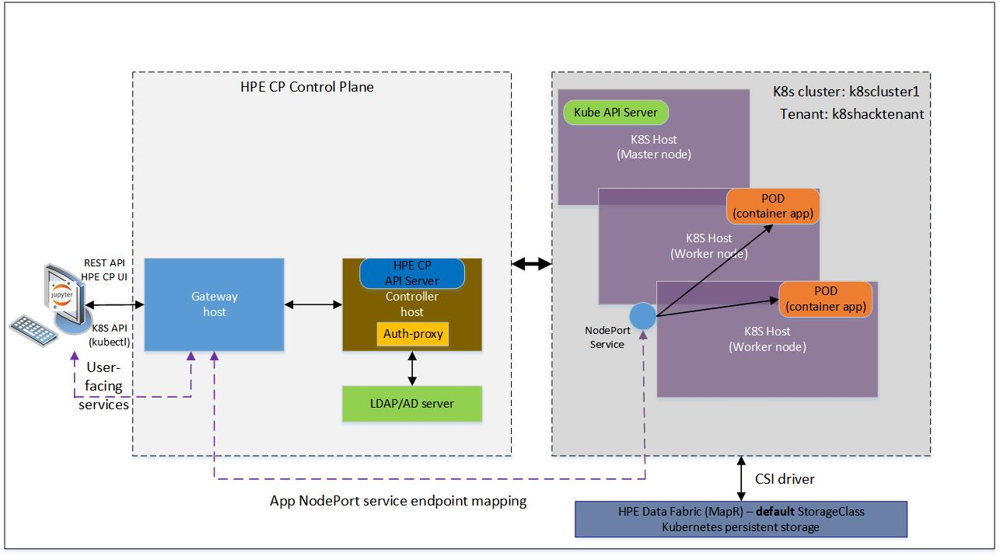

# Introduction to the HPE Ezmeral Container Platform REST API

Version: HPE Ezmeral Container Platform 5.0

HPE Ezmeral Container Platform (HPE CP) uses **container technology** to make it simpler and more cost-effective to deploy, run and manage both cloud native microservices enterprise workloads and non-cloud native monolithic stateful applications for machine learning, deep learning, and big data analytics use cases.

This workshop focuses on how developers can interact with HPE CP programmatically through its REST API to accelerate their application development and deployment on containers. The workshops does not cover how to perform IT administrative tasks through the REST API.

You will start you off with some fundamental knowledge about how to interact with the HPE Ezmeral Container Platform programmatically through its REST API. As a tenant user, you will learn how to perform authentication, deploy cloud native stateless applications and non-cloud native distributed multi-node applications for AI/ML and data analytics, and interpret/respond to the status of your REST API calls. We will walk you through the process, step by step. By the end of the session, you'll be deploying a TensorFlow application framework and other simple applications. 

# Prerequisites

## Jupyter requirements

The notebook uses the Bash kernel. We'll primarily use `cURL` (Command-Line URL) to make REST API calls. cURL is the universal and well-appreciated utility in the Linux community. You will then use `kubectl` (installed on the JupyterHub server) to make K8s API calls and interact with the Kubernetes cluster in the context of your tenant user account.

## Other dependencies
- Access to HPE Ezmeral Container Platform deployment.
- IP address or FQDN of the HPE Ezmeral Container Platform's Gateway host.
- A Kubernetes cluster deployed and managed by HPE Exmeral Container Platform. 
- a Kubernetes tenant user account.  
- Kubectl hpecp plugin installed on same directory as kubectl on JupyterHub server. 

# Lab environment - A high level overview of the physical architecture of the HPE Ezmeral Container Platform deployment
This high-level architecture diagram depicts how you can interact programmatically with the HPE Ezmeral Container Platform. 
    

      

Our HPE Controller Platform deployment is comprised of a number of components:
1. The `Controller host` manages all the hosts that comprise the HPE Ezmeral Container Platform deployment.
2. The `Kubernetes (K8s) hosts` are under the direct control of the Controller host. These hosts can be grouped into one or more distinct Kubernetes clusters that run containerized applications.
3. The `Gateway host` acts as a proxy server that carries client requests like HPE CP UI, REST API, K8s API (kubectl commands), to the HPE Ezmeral Container Platform controller, to one of the K8s clusters, or to the containerized application services running in one of the K8s clusters. Containerized application service endpoints are exposed outside the Kubernetes cluster to users via the gateway re-mapped ports. 
4. The `Authentication Proxy` handles user authentication and forwards authenticated K8s API traffic (kubectl commands) to the Kubernetes cluster master and returns any responses to the request back to the user.
5. The `HPE Ezmeral Data Fabric` (a MapR File System) is a storage provider for persistent volumes for the applications that require persistence of data. The default StorageClass is available out of the box from the HPE Ezmeral Data Fabric (formerly MapR Data Platform) using the HPE Container Storage Interface (CSI) driver for MapR.

[View the notebook Lab 1](./1-WKSHP-HPECP-IntroAndAuth.ipynb)

[View the notebook Lab 2](./2-WKSHP-HPECP-DeployApp-K8S-Tenant-tf.ipynb)