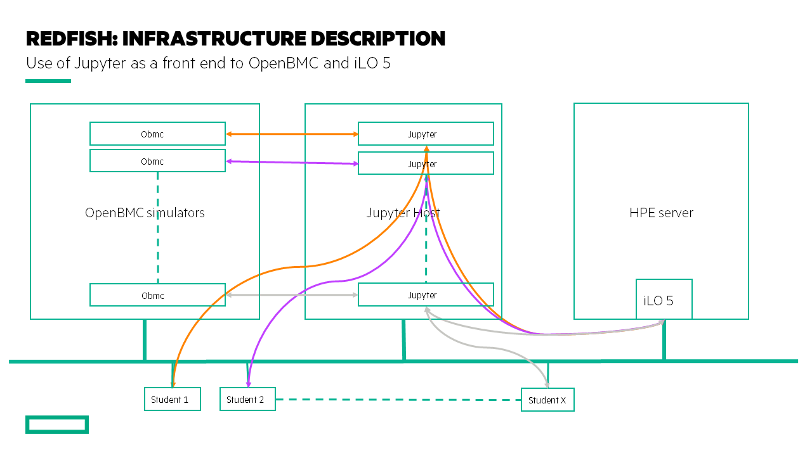

# Welcome to the Hack Shack

Powered by [HPE DEV Team](hpedev.io)

Version 0.45

# Speakers : [Troy Heber](mailto:Troy.Heber@hpe.com) / [François Donzé](francois.donze@hpe.com)

Find us on [YouTube](https://www.youtube.com/channel/UCIZhrIYcNh3wHLiY4ola5ew), [Blog](https://developer.hpe.com/blog)

  
  

# Introduction to Redfish API Use With PowerShell Python and Bash/cURL

**Abstract**: After a quick positioning of the DMTF Redfish API, we'll explore a Redfish tree to understand its basic structure. In addition we'll learn how to modify resources and perform actions using different tools. Best practices will be presented as well. Beginners and experts are welcome.

# Lab flow
HackShack Workshops are delivered through a central point that allows a portable, dynamic version of the lab guides. Rather than using standard PDF files which always end in copy / paste errors from the lab guide into the TS sessions, this year we decided to innovate and introduce a brand-new infrastructure. We will leverage a JupyterHub server on which all the different lab guides will be stored in a notebook format (*.ipynb). These Jupyter Notebooks are accessible from the internet for the event.

## Handouts
You can freely copy the Jupyter Notebooks, including their output, in order to practice back at your office at your own pace, leveraging a local installation of Jupyter Notebook on your laptop.
- You install the Jupyter Notebook application from [here](https://jupyter.org/install). 
- A Beginners Guide is also available [here](https://jupyter-notebook-beginner-guide.readthedocs.io/en/latest/what_is_jupyter.html)
To download the notebooks, just right click on them and select `Download`.

Please listen now to the instructor's guidelines on how to use Jupyter and follow along as the different steps are covered. Enjoy the labs!

Happy labs ! :-)

 

## What is Redfish? 

As per the [Redfish](https://www.dmtf.org/standards/redfish) home page, DMTF Redfish® is a standard designed to deliver **simple and secure management** for converged, hybrid IT and the Software Defined Data Center (SDDC)". 

## Workshop goal

At the end of the workshop, you should be able to 1) explain the basic architecture of the Redfish resource tree; 2) explain why it is crucial to follow [best practices](https://developer.hpe.com/blog/getting-started-with-ilo-restful-api-redfish-api-conformance) when programming the Redfish API; and 3) explain the session-based authentication mechanism.

## Workshop infrastructure

Each student, or team, has a dedicated [Jupyter](https://jupyter.org/) environment hosted by a Linux host that provides a set of [Jupyter notebooks](https://jupyter-notebook-beginner-guide.readthedocs.io/en/latest/what_is_jupyter.html).

The notebooks can access a dedicated [OpenBMC](https://www.openbmc.org/) appliance simulator with `GET` and `SET` methods, and a shared [HPE iLO 5](http://hpe.com/info/ilo) (in `GET` mode only).

# Lab description

> **NOTE**: Since the content of [Lab 1](1-Discover-RedfishBash.ipynb) and [Lab 2](2-Discover-RedfishPowerShell.ipynb) are identical, you can choose either one depending on your skills and preferences. If you are more Linux/Bash/cURL oriented, choose  [Lab 1](1-Discover-RedfishBash.ipynb). If you are more Windows/PowerShell focused, choose [Lab 2](2-Discover-RedfishPowerShell.ipynb). 

### [Lab 1](1-Discover-RedfishBash.ipynb): Redfish overview using Bash/cURL

Redfish tree overview using [Bash](https://www.gnu.org/software/bash/) and [cURL](https://curl.haxx.se/) tool against an OpenBMC simulator followed by a reset of the OpenBMC. Choose this lab if you are more Linux/Bash/cURL oriented.

### [Lab 2](2-Discover-RedfishPowerShell.ipynb): Redfish overview using PowerShell
Identical to Lab 1, but uses PowerShell commands. Choose this lab if you are more Windows/PowerShell focused.

### [Lab 3](3-Discover-RedfishPython.ipynb): Browsing multiple Redfish implementations using a single piece of code
Single Python program to retrieve MAC addresses from an OpenBMC and from an HPE iLO 5. 

